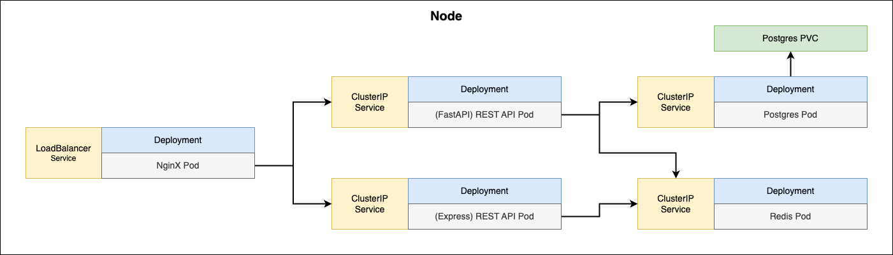

# Snippets Container Orchestration

## Env Setup

Setup Postgres
```console
kubectl create secret generic pgpassword --from-literal PGPASSWORD=postgres
kubectl apply -f k8s_postgres
```

Setup Redis
```console
kubectl apply -f k8s_redis
```

Setup Py REST API v1.1.5 (docker image)
```console
kubectl apply -f k8s_pyrest
```

### Diagram



